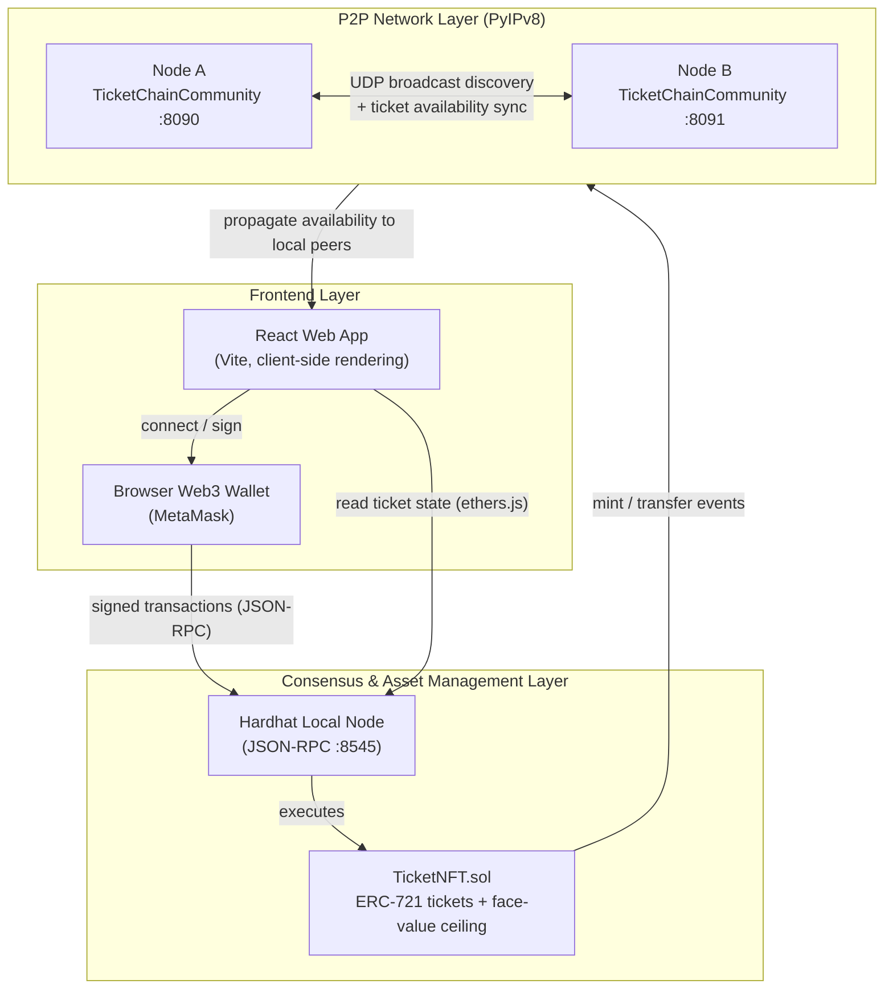

# TicketChain — System Architecture (Week 1)

The system is split into three layers: the React frontend, the local Hardhat
blockchain node holding the `TicketNFT` smart contract, and the PyIPv8
peer-to-peer overlay that propagates ticket availability between localized
nodes.

## Flow summary

1. A user opens the React app and connects their browser wallet.
2. Minting and transfers are signed in the wallet and sent to the local
   Hardhat node over JSON-RPC, where `TicketNFT.sol` enforces the
   face-value price ceiling (anti-scalping).
3. Contract events are picked up by the PyIPv8 layer, whose
   `TicketChainCommunity` overlay broadcasts ticket availability to peers
   discovered on the local network (UDP broadcast bootstrapping — no public
   trackers).
4. Peer nodes surface the synchronized availability back to their local UIs.
