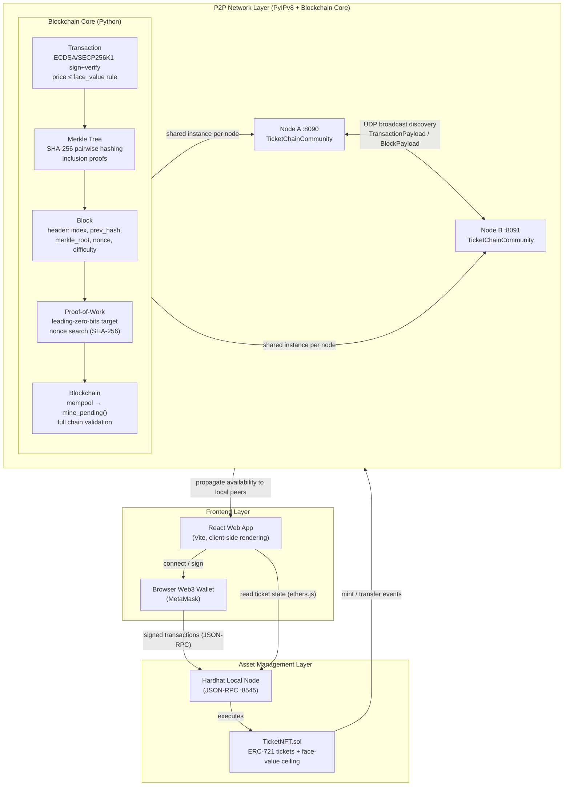

# TicketChain — System Architecture

The system is split into three layers: the React frontend, the local Hardhat
node holding the `TicketNFT` smart contract (NFT asset management), and the
PyIPv8 peer-to-peer overlay running a hand-built blockchain core for
transaction propagation, Merkle-verified blocks, and Proof-of-Work consensus.



## Flow summary

1. A user opens the React app and connects their browser wallet.
2. Minting and transfers are signed in the wallet and sent to the local
   Hardhat node over JSON-RPC, where `TicketNFT.sol` enforces the
   face-value price ceiling (anti-scalping).
3. Off-chain ticket transfers are represented as `Transaction` objects,
   signed with SECP256K1 ECDSA. Each transaction carries `price` and
   `face_value` fields; the anti-scalping rule (`price ≤ face_value`) is
   enforced during validation before a transaction enters the mempool.
4. When enough transactions accumulate, a node calls `mine_block()`:
   - A `MerkleTree` is built over all pending transaction hashes.
   - A new `Block` is created with the Merkle root, the previous block's
     hash, and a difficulty target.
   - The PoW miner increments a nonce until the SHA-256 block hash has the
     required number of leading zero bits (default: 16 bits).
   - The mined block is broadcast to all peers as a `BlockPayload`.
5. Receiving peers validate the full chain (PoW, prev-hash linkage, Merkle
   root, all signatures) before appending the block.
6. The `TicketChainCommunity` overlay uses IPv8's UDP broadcast bootstrapping
   for peer discovery — no public trackers, keeping the network localized.

## Blockchain core module layout

```
network/
  blockchain/
    __init__.py       — public API re-exports
    transaction.py    — Transaction dataclass, sign(), verify(), is_valid()
    merkle.py         — MerkleTree, merkle_root(), get_proof(), verify_proof()
    block.py          — BlockHeader, Block, genesis_block()
    pow.py            — mine(), verify_pow(), meets_difficulty()
    chain.py          — Blockchain (mempool, mine_pending, is_chain_valid)
  test_blockchain.py  — 33 pytest tests (transactions, Merkle, PoW, chain)
  main.py             — IPv8 node with TicketChainCommunity + broadcast payloads
```
