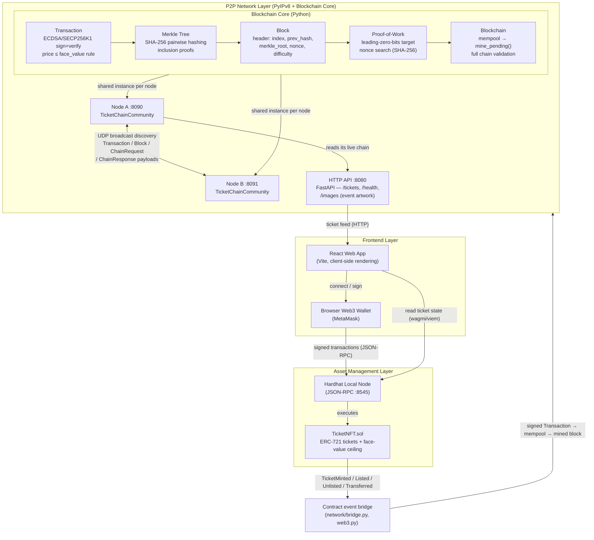

# TicketChain — System Architecture

The system is split into three layers: the React frontend, the local Hardhat
node holding the `TicketNFT` smart contract (NFT asset management), and the
PyIPv8 peer-to-peer overlay running a hand-built blockchain core for
transaction propagation, Merkle-verified blocks, and Proof-of-Work consensus.



## Flow summary

1. A user opens the React app and connects their browser wallet.
2. Minting and transfers are signed in the wallet and sent to the local
   Hardhat node over JSON-RPC, where `TicketNFT.sol` enforces the
   face-value price ceiling (anti-scalping).
3. Each state change on the contract emits an event. `bridge.py` polls the
   Hardhat node for `TicketMinted`, `TicketListed`, `TicketUnlisted` and
   `TicketTransferred`, and turns every one into a `Transaction` object on the
   P2P side — this is the link between the two ledgers, so the peer-replicated
   chain records what actually happened on Ethereum rather than a parallel
   history.
4. Those `Transaction` objects are signed with SECP256K1 ECDSA and carry
   `price` and `face_value`; the anti-scalping rule (`price ≤ face_value`) is
   enforced during validation before a transaction enters the mempool.
5. Once a batch of events has been published, the node calls `mine_block()`:
   - A `MerkleTree` is built over all pending transaction hashes.
   - A new `Block` is created with the Merkle root, the previous block's
     hash, and a difficulty target.
   - The PoW miner increments a nonce until the SHA-256 block hash has the
     required number of leading zero bits (default: 16 bits).
   - The mined block is broadcast to all peers as a `BlockPayload`.
6. Receiving peers validate the full chain (PoW, prev-hash linkage, Merkle
   root, all signatures) before appending the block.
7. A peer that is behind — it missed a packet, or joined late — asks for the
   sender's chain with a `ChainRequestPayload` and adopts the reply only if it
   is strictly longer, shares our genesis block, and validates completely
   (`Blockchain.should_replace_with`). Without this a node that missed a single
   block could never catch up.
8. The `TicketChainCommunity` overlay uses IPv8's UDP broadcast bootstrapping
   for peer discovery — no public trackers, keeping the network localized. The
   overlay's `community_id` is derived from the event name, so nodes for
   different events form disjoint networks.
9. The node serves its live chain over HTTP (`GET /tickets`, `GET /health`),
   which is what the frontend reads for the P2P view of ticket availability. It
   also stores event artwork: the organizer's upload is `POST`ed to `/images`,
   saved under the SHA-256 of its bytes, and served back from `/images/{hash}`.
   Only that hash goes on-chain, and `TicketNFT.tokenURI` resolves it against
   `imageBaseURI` — tickets minted without an upload carry an SVG generated
   in the contract instead, so they render with no host at all.

## Blockchain core module layout

```
network/
  blockchain/
    __init__.py       — public API re-exports
    transaction.py    — Transaction dataclass, sign(), verify(), is_valid()
    merkle.py         — MerkleTree, merkle_root(), get_proof(), verify_proof()
    block.py          — BlockHeader, Block, genesis_block()
    pow.py            — mine(), verify_pow(), meets_difficulty()
    puzzle.py         — per-message search puzzle (solve/verify), Sybil resistance
    chain.py          — Blockchain (mempool, mine_pending, is_chain_valid,
                        should_replace_with — the longest-valid-chain rule)
  main.py             — IPv8 node: TicketChainCommunity, message payloads,
                        chain sync, node startup
  bridge.py           — watches TicketNFT events and republishes them as
                        signed P2P transactions
  api.py              — FastAPI app: /tickets, /health, and content-addressed
                        event artwork upload/serving at /images
  benchmark.py        — transaction, block-finality and P2P latency benchmarks
  test_blockchain.py  — 54 pytest tests (transactions, Merkle, PoW, chain,
                        puzzle, chain sync, HTTP API)
  test_two_nodes.py   — live two-node discovery and chain-convergence test
```
